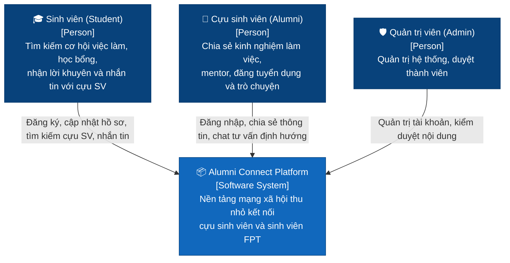
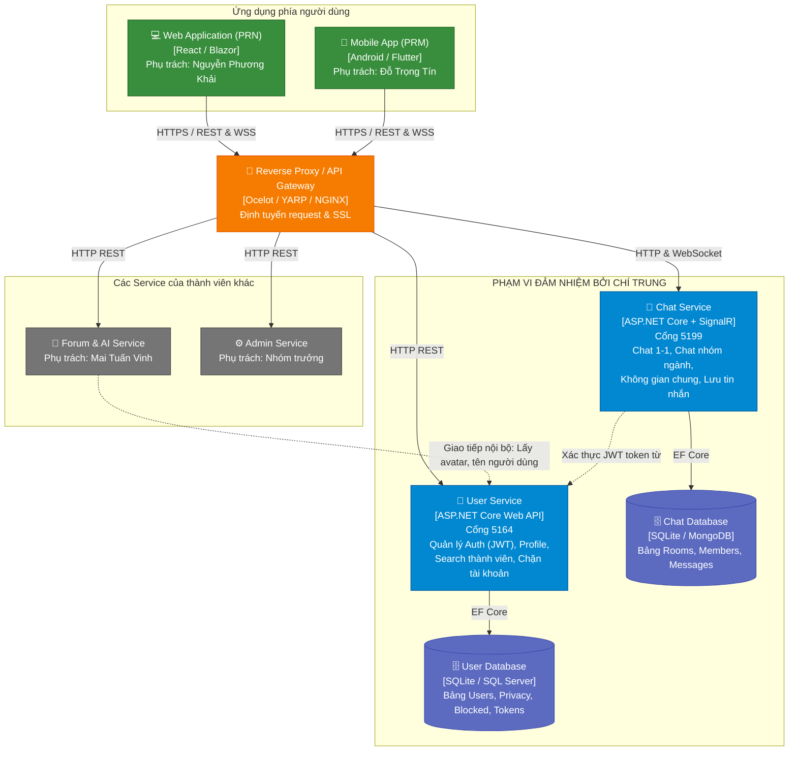

# TÀI LIỆU THIẾT KẾ KIẾN TRÚC C4 MODEL & API
## DỰ ÁN: ALUMNI CONNECT (NỀN TẢNG KẾT NỐI SINH VIÊN & CỰU SINH VIÊN)
**Người phụ trách:** Nguyễn Chí Trung  
**Phạm vi đảm nhiệm:** User Service + Chat Service + Kiến trúc C4 Model  
**Công nghệ:** C# .NET 10, ASP.NET Core Web API, Entity Framework Core, SignalR, SQLite / SQL Server, JWT Bearer Authentication  

---

## 1. TỔNG QUAN PHẠM VI (SCOPE OF RESPONSIBILITY)

| Thành viên | Trách nhiệm |
| :--- | :--- |
| **Nguyễn Chí Trung (Tôi)** | **User Service** (US-01 đến US-10) + **Chat Service** (Real-time & Lưu tin nhắn) + **Thiết kế kiến trúc C4** |
| Mai Tuấn Vinh | Forum Service + AI Service + Vẽ architecture của Vinh |
| Nhóm trưởng | Admin Service + Soạn các user story + Vẽ architecture của Admin |
| Nguyễn Phương Khải | Front-end Web (Môn PRN) |
| Đỗ Trọng Tín | Mobile App (Môn PRM) |

---

## 2. KIẾN TRÚC C4 MODEL (THE C4 MODEL)

Kiến trúc C4 phân tách hệ thống thành các cấp độ từ tổng quan đến chi tiết, tập trung làm rõ vai trò của **User Service** và **Chat Service**.

### 2.1. C4 Level 1: System Context Diagram (Bối cảnh hệ thống)
Mô tả cách người dùng trường đại học (Sinh viên, Cựu sinh viên, Quản trị viên) tương tác với nền tảng Alumni Connect.



---

### 2.2. C4 Level 2: Container Diagram (Kiến trúc Container / Microservices)
Làm nổi bật ranh giới phạm vi của **Chí Trung (User Service & Chat Service)** trong tương tác với Client (FE Web của Khải & Mobile của Tín) và các Service khác (Forum & Admin).



---

### 2.3. C4 Level 3: Component Diagram (Chi tiết các thành phần bên trong)

#### A. Component Diagram: User Service
```mermaid
flowchart TD
    classDef ctrl fill:#1976D2,stroke:#0D47A1,color:#fff;
    classDef srv fill:#00897B,stroke:#004D40,color:#fff;
    classDef data fill:#5E35B1,stroke:#311B92,color:#fff;
    classDef mw fill:#E65100,stroke:#BF360C,color:#fff;

    ClientReq["Client HTTP Requests"]

    subgraph UserService [User Service (ASP.NET Core)]
        TokenMW["TokenRevocationMiddleware\nKiểm tra token đã logout chưa (US-08)"]:::mw

        AuthController["AuthController\n(US-01, US-02, US-03, US-07, US-08)"]:::ctrl
        ProfileController["ProfileController\n(US-04, US-05, US-09)"]:::ctrl
        UsersController["UsersController\n(US-06 Search, US-10 Block)"]:::ctrl

        AuthService["AuthService\nLogic Đăng nhập, Google OAuth, Đổi MK"]:::srv
        TokenService["TokenService\nTạo JWT & Quản lý Blacklist Token"]:::srv
        ProfileService["ProfileService\nLogic Profile & Quyền riêng tư"]:::srv
        MemberService["MemberService\nLogic Tìm kiếm có phân trang & Chặn"]:::srv

        UserDbContext["UserDbContext (EF Core)"]:::data
    end

    ClientReq --> TokenMW
    TokenMW --> AuthController
    TokenMW --> ProfileController
    TokenMW --> UsersController

    AuthController --> AuthService
    AuthController --> TokenService
    AuthService --> TokenService
    AuthService --> UserDbContext

    ProfileController --> ProfileService
    ProfileService --> UserDbContext

    UsersController --> MemberService
    MemberService --> UserDbContext
```

#### B. Component Diagram: Chat Service
```mermaid
flowchart TD
    classDef hub fill:#D81B60,stroke:#880E4F,color:#fff;
    classDef ctrl fill:#1976D2,stroke:#0D47A1,color:#fff;
    classDef data fill:#5E35B1,stroke:#311B92,color:#fff;

    WSClient["WebSocket Client\n(SignalR Client)"]
    RESTClient["HTTP REST Client"]

    subgraph ChatService [Chat Service (ASP.NET Core)]
        ChatHub["ChatHub (/hubs/chat)\nQuản lý kết nối, JoinRoom, Gửi Real-time,\nTyping Indicator"]:::hub
        ChatController["ChatController (/api/chat)\nLấy danh sách phòng, Lịch sử chat,\nTạo phòng 1-1, Tạo phòng nhóm ngành"]:::ctrl
        ChatDbContext["ChatDbContext (EF Core)\nLưu Rooms, Members, Messages"]:::data
    end

    WSClient <-->|WSS (SignalR)| ChatHub
    RESTClient -->|HTTP GET/POST| ChatController

    ChatHub --> ChatDbContext
    ChatController --> ChatDbContext
    ChatController -->|IHubContext broadcast| ChatHub
```

---

## 3. MAPPING 10 USER STORIES (US-01 ĐẾN US-10) VÀO API

Dưới đây là đặc tả chi tiết của từng User Story đã được code hoàn thiện trong project:

| Mã US | Mô tả User Story | Endpoint API | Method | Header / Auth |
| :--- | :--- | :--- | :--- | :--- |
| **US-01** | Đăng nhập bằng Email và mật khẩu | `/api/auth/login` | `POST` | Public |
| **US-02** | Đăng nhập bằng Google | `/api/auth/google-login` | `POST` | Public |
| **US-03** | Xác minh email đã đăng ký | `/api/auth/verify-email`<br>`/api/auth/resend-verification` | `POST`<br>`POST` | Public |
| **US-04** | Cập nhật hồ sơ (Tên, Avatar, Campus, Chuyên ngành, Khóa, Bio) | `/api/profile/me` | `PUT` | `Bearer {token}` |
| **US-05** | Xem hồ sơ của sinh viên/cựu SV khác | `/api/profile/{id}` | `GET` | Tự động áp dụng quyền riêng tư |
| **US-06** | Tìm kiếm thành viên theo Tên, Campus, Chuyên ngành | `/api/users/search` | `GET` | Params: `keyword, campus, major, page, pageSize` |
| **US-07** | Đổi mật khẩu & Đặt lại mật khẩu | `/api/auth/change-password`<br>`/api/auth/forgot-password`<br>`/api/auth/reset-password` | `POST`<br>`POST`<br>`POST` | `Bearer {token}` cho đổi MK<br>Public cho quên/đặt lại MK |
| **US-08** | Đăng xuất & Vô hiệu hóa Token ngay lập tức | `/api/auth/logout` | `POST` | `Bearer {token}` |
| **US-09** | Tùy chỉnh quyền riêng tư hiển thị trên Profile | `/api/profile/privacy` | `GET` / `PUT` | `Bearer {token}` |
| **US-10** | Chặn tài khoản / Bỏ chặn / Danh sách chặn | `/api/users/{id}/block`<br>`/api/users/{id}/block`<br>`/api/users/blocked` | `POST`<br>`DELETE`<br>`GET` | `Bearer {token}` |

---

## 4. ĐẶC TẢ CHAT SERVICE (REAL-TIME SIGNALR & REST)

### 4.1. REST API
- `GET /api/chat/rooms`: Lấy danh sách các phòng chat (gồm các phòng nhóm ngành: IT, Kinh tế, Thiết kế, Không gian chung, và các phòng 1-1).
- `POST /api/chat/rooms/direct`: Tạo hoặc mở cuộc trò chuyện 1-1 giữa Sinh viên và Cựu sinh viên.
- `POST /api/chat/rooms/group`: Tạo phòng chat nhóm ngành mới.
- `GET /api/chat/rooms/{roomId}/messages?page=1&pageSize=50`: Lấy lịch sử tin nhắn trong phòng (sắp xếp theo thời gian).
- `POST /api/chat/rooms/{roomId}/messages`: Gửi tin nhắn qua REST API (và tự động broadcast qua SignalR tới người nghe).

### 4.2. SignalR Hub (`/hubs/chat`)
- **Kết nối:** `wss://localhost:7078/hubs/chat?access_token={jwt_token}` hoặc `http://localhost:5199/hubs/chat?access_token={jwt_token}`.
- **Client gọi (Invoke):**
  - `JoinRoom(roomId)`: Tham gia phòng chat.
  - `LeaveRoom(roomId)`: Rời phòng chat.
  - `SendMessage(roomId, content)`: Gửi tin nhắn real-time.
  - `SendTyping(roomId, isTyping)`: Báo trạng thái đang soạn tin.
- **Client lắng nghe (Listen):**
  - `ReceiveMessage`: Nhận tin nhắn mới tức thời.
  - `UserJoined`: Báo có thành viên mới vào phòng.
  - `UserLeft`: Báo có thành viên rời phòng.
  - `UserTyping`: Hiển thị "X đang nhập tin nhắn...".

---

## 5. HƯỚNG DẪN CHẠY VÀ KIỂM THỬ (DEMO)

### Dữ liệu mẫu (Seed Data) đã có sẵn:
1. **Tài khoản Cựu sinh viên (Alumni):**
   - Email: `alumni.nam@fpt.edu.vn`
   - Password: `123456`
   - Vai trò: Alumni (Kỹ thuật phần mềm - K14 FPT Hòa Lạc)
2. **Tài khoản Sinh viên (Student):**
   - Email: `student.trung@fpt.edu.vn`
   - Password: `123456`
   - Vai trò: Student (Kỹ thuật phần mềm - K17 FPT HCM)

### Các lệnh chạy hệ thống:
```bash
# 1. Chạy User Service (Cổng Swagger: http://localhost:5164)
dotnet run --project src/Services/UserService/UserService.csproj

# 2. Chạy Chat Service (Cổng Swagger: http://localhost:5199)
dotnet run --project src/Services/ChatService/ChatService.csproj
```
Mở trình duyệt truy cập `http://localhost:5164` và `http://localhost:5199` để thấy giao diện trực quan Swagger UI để test toàn bộ các API!
